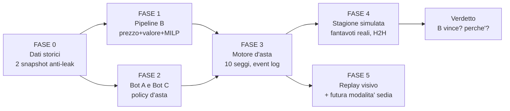

# FantaBot — Piano operativo: costruzione B + torneo d'asta simulata B vs A vs C

> Piano esecutivo, niente codice. Decisioni recepite dal committente: 10 partecipanti totali al tavolo (1 seggio per B, 9 avversari misti A e C); backtest su stagioni 2024/25 e 2025/26; ogni asta si tiene il giorno dopo la chiusura del mercato estivo di quella stagione; niente dati delle aste personali — prezzi da fonti pubbliche; niente asta di riparazione; rosa ~3P/7-8D/7-8C/5A (da confermare); formazione a 11 con max 3 cambi; visualizzazione dell'asta curata, con chiamate, battute e controbattute, predisposta per la futura modalità "prendo una sedia e partecipo anch'io".

---

## 0. L'idea in una frase

Costruiamo la pipeline B (predittore prezzi + valore + MILP + replanner live), poi la mettiamo alla prova in un torneo di aste simulate complete — chiamata per chiamata, rilancio per rilancio — contro bot A (formule classiche) e bot C (avversari umani-realistici), sulle stagioni 2024/25 e 2025/26; le rose uscite dall'asta giocano poi la stagione reale con i fantavoti veri, e si conta chi vince. Il tutto guardabile in un replay animato.



---

## 1. Fonti prezzi — RISOLTO (aggiornamento 6/8/2026, dati già congelati in `fonti_prezzi/`)

Tre pilastri, già scaricati e verificati:

1. **Prezzi medi storici da archivi web pubblici** — medie d'acquisto per configurazione di lega, inclusa **10 squadre / 500 crediti** (`p500_10sq` = esattamente la lega target). Storico ricostruito per stagione: 2023/24 (433 giocatori con prezzo), 2024/25 (331), 2025/26 (331+334). In Fase 0: enumerazione degli snapshot d'archivio per massimizzare copertura e profondità (possibile ≥2018/19).
2. **Aste REALI complete — forum GruppoEsperti "Progetto Prezzi Asta"** (upgrade maggiore): Google Sheets community con aste vere integrali — per ogni asta: n. componenti, crediti totali, modificatore, periodo, e ogni giocatore col prezzo pagato. Edizioni 2020-21→2024-25 (2 xlsx già salvati, ~125+ aste per edizione; altri sheet ID da vagliare in Fase 0). Conseguenze sul piano:
   - Il modello prezzo di B non impara più da MEDIE ma da **distribuzioni reali di prezzi** (target: % budget, filtrando/pesando le aste per similarità di configurazione con 10/500) → i quantili P10/P90 di TabPFN si calibrano su varianza VERA tra aste, non stimata.
   - I **bot C si calibrano su dati reali**: spread osservato dello stesso giocatore tra aste diverse = ampiezza del rumore lognormale; correlazioni di reparto e over/underpay per fascia misurabili direttamente.
   - Anche la formula VORP di A si àncora meglio (conversione crediti empirica).
3. **FVM storico ufficiale** (fantacalcio.it, export dal 2015/16, base 1000) — feature e riempi-buchi per i giocatori senza prezzo osservato.

Complementi: archivio quotazioni per OGNI giornata (perfetto per lo snapshot "giorno dopo fine mercato": si prende la quotazione vigente a quella data esatta); statistiche storiche dal 2002; articoli PMA per sanity check sui top player.

---

## 2. Configurazione lega (file di config, non hardcode)

```
partecipanti: 10          # confermato
budget: 500               # confermato
rosa: 3P / 8D / 8C / 6A   # CONFERMATO dal committente
formazione: 11 titolari, moduli classic (343,352,433,442,451,532,541)
cambi: max 3 per giornata, ordine panchina
asta: a chiamata, ruoli in ordine P->D->C->A, rilancio minimo +1,
      giro di chiamata a rotazione, ordine iniziale casuale (seed),
      nessuno puo' saltare la chiamata,
      max offerta = crediti - (slot vuoti - 1)
data asta: giorno dopo chiusura mercato estivo
      2024/25 -> mercato chiuso 30-31/8/2024 -> asta 1/9/2024 (data esatta verificata in Fase 0)
      2025/26 -> mercato chiuso 1/9/2025 -> asta 2/9/2025
riparazione: NO (esclusa; eventuali infortuni lunghi restano zavorra per tutti allo stesso modo)
```

---

## 3. FASE 0 — Dati e snapshot anti-leakage

Due "fotografie del mondo" congelate, una al 1/9/2024 e una al 2/9/2025. Regola ferrea: **ogni numero usato nell'asta X deve essere stato conoscibile il giorno dell'asta X.** I fantavoti della stagione servono solo DOPO, in Fase 4, per giocare il campionato.

Per ogni snapshot:
1. **Listone/quotazioni** di quella stagione (fantacalcio.it archivio, export Excel): Qt.I, FVM, ruolo, squadra — inclusi i trasferimenti di fine mercato (il listone viene aggiornato fino a chiusura: verificare che l'archivio rifletta la versione post-mercato; se no, correzione manuale con tabellone trasferimenti Sky/Goal di quell'estate).
2. **Storico pre-asta**: voti/fantavoti/bonus per giornata delle 2-3 stagioni PRECEDENTI lo snapshot (fantacalcio.it export; profondità extra da PianetaFanta se serve), presenze/minuti, rigoristi.
3. **Statistiche avanzate**: xG/xA da Understat (dal 2014/15), minuti da FBref; valori Transfermarkt dal dataset `dcaribou/transfermarkt-datasets` (storico settimanale → si può ricostruire il valore "a quella data").
4. **Prezzi di riferimento** di quella stagione (catena §1).
5. **Nuovi arrivi** senza storico Serie A: stats del campionato di provenienza (Understat top-5) + valore Transfermarkt.

Deliverable Fase 0: dataset unico `players_{stagione}.parquet` (una riga = giocatore × stagione, ~600 righe/stagione, 30-50 feature) + report qualità (copertura prezzi, giocatori orfani, join falliti sui nomi — il name-matching tra fonti è il lavoro sporco prevedibile).

Training del modello prezzo: per l'asta 2024/25 si allena su stagioni ≤2023/24; per l'asta 2025/26 su ≤2024/25. Mai il contrario (leave-future-out).

---

## 4. FASE 1 — Costruzione pipeline B (il concorrente)

### 4a. Modello VALORE (fantapunti attesi stagione)
- Baseline Marcel: fantamedia pesata 3 stagioni con regressione verso la media + curva età + aggiustamento titolarità/rigori.
- Sfidante: CatBoost sulle stesse feature + xG. Vince chi fa meglio in leave-one-season-out. Output per giocatore: punti attesi + incertezza.

### 4b. Modello PREZZO (cuore di B)
- Target: prezzo in **% del budget** (così 350K, 500, FVM/1000 convivono).
- Modelli in gara: **TabPFN** (regressione distribuzionale, quantili P10/P50/P90 nativi) vs **CatBoost quantile** vs formula-A (VORP). Ensemble se aiuta (pattern TabArena).
- Validazione: allena su ≤2023/24 → predici prezzi 2024/25; poi ≤2024/25 → 2025/26. Metriche: MAE per fascia, copertura reale degli intervalli P10-P90, ranking correlation.

### 4c. Claude come valutatore — e il problema onestà del backtest
Io conosco già come sono andate le stagioni 2024/25 e 2025/26 (training data): qualsiasi mio "giudizio qualitativo su Retegui ad agosto 2024" è contaminato dal senno di poi. Quindi:
- **Nel backtest gareggia B1 = pipeline pura ML**, senza feature Claude. Risultato pulito e difendibile.
- **B2 = B1 + feature Claude** si costruisce lo stesso, ma si usa SOLO in avanti, sull'asta reale 2026/27 (dove il futuro non lo conosce nessuno). Facoltativo: girare anche B2 nel backtest con etichetta "contaminato, solo indicativo".

### 4d. Policy d'asta di B (come si comporta al tavolo, deterministica e spiegabile)
1. Pre-asta: MILP (PuLP/CBC) → 3-5 rose scenario con obiettivi primari, alternative per slot, **max bid per giocatore** = min(quantile alto del prezzo, valore VORP × tolleranza) × fattore inflazione corrente.
2. A ogni aggiudicazione (anche altrui): aggiorna crediti/max-bid di tutti, fattore inflazione (crediti residui in stanza / valore residuo listino), scarcity per ruolo → **ri-esegue il MILP** (<1s) e aggiorna i target.
3. Rilancio: rilancia finché prezzo < max bid corrente; mai price enforcing su ruoli scoperti; nomination = chiama presto i top che non vuole, mai per primo i propri target di fascia.
4. Ogni azione emette un "pensiero" (una riga: perché ha rilanciato/passato) → finisce nell'event log per il replay.

---

## 5. FASE 2 — I 9 avversari: bot A e bot C

**Bot A (2-3 al tavolo)** — "il ragioniere": lista VORP→crediti calcolata sui soli dati pre-asta, max bid rigidi, allocazione budget da guida (P 7% / D 14% / C 25% / A 54%), nessun replanning sofisticato. Varianti: A-rigido (mai oltre lista), A-flessibile (+10% sui target).

**Bot C (6-7 al tavolo)** — "gli amici": agenti umani-realistici, valutazioni private = prezzo di riferimento × rumore lognormale + bias di profilo. Profili dai pattern documentati nelle guide:
- lo **Stars&Scrubs** (60-70% su 3-4 top, resto a 1),
- il **Semitop** (evita i top strapagati, accumula fascia media),
- il **Tifoso** (bias +30% sui giocatori della sua squadra del cuore),
- l'**Ancorato** (si aggancia ai prezzi già visti: il secondo portiere top lo paga come il primo +10%),
- il **Panic buyer** (se perde 2 target di fila, +25% sul prossimo),
- il **Tirchio** (risparmia, finisce l'asta con crediti in mano),
- l'**Enforcer** (alza i prezzi altrui, ogni tanto si incastra — errore classico n.4 di Sky).

I profili C riproducono anche i pattern empirici misurati (primo top chiamato va sotto prezzo, nominati-presto sopra AAV il 75% delle volte): la simulazione li deve far EMERGERE, ed è un test di realismo del motore — se non emergono, i bot C sono tarati male.

---

## 6. FASE 3 — Motore d'asta e torneo

- Motore a eventi: chiamata → giro di rilanci (+1 minimo) → aggiudicazione all'ultimo rilancio; vincolo max offerta sempre applicato; ruoli in blocchi P→D→C→A; giro di chiamata a rotazione con ordine iniziale da seed.
- **Event log JSONL completo**: ogni chiamata, ogni singolo rilancio (chi, quanto, il "pensiero"), ogni passata, aggiudicazione, stato budget/rose dopo ogni evento. È il combustibile del replay di Fase 5 e dell'analisi.
- **Torneo**: per ciascuna stagione (2024/25, 2025/26) × composizione tavolo (default 1B+2A+7C; sensibilità: 1B+9C, 1B+4A+5C) × **150-300 repliche** con seed diversi (ordine chiamata, rumore valutazioni C). Migliaia di aste totali: costo computazionale banale, è tutto deterministico+rumore, niente LLM nel loop.
- Un solo B al tavolo per design (i suoi prezzi predetti sono "pubblici" tra più B → si cannibalizzerebbero; eventualmente esperimento extra B-vs-B per curiosità, fuori dal verdetto).

---

## 7. FASE 4 — La stagione: si gioca con i fantavoti veri

- Ogni rosa uscita da ogni asta gioca le 38 giornate della sua stagione con i fantavoti reali.
- **Lineup engine identico per tutti** (fairness): titolari scelti per fantamedia mobile + titolarità nota fino a quella giornata (niente senno di poi), modulo migliore tra i classic, panchina ordinata, **max 3 cambi** per chi resta senza voto, soglie gol standard (66+6).
- Doppia classifica: (a) somma punti totali; (b) campionato H2H — calendario casuale tra i 10, ripetuto 100 volte per lavare via la fortuna del calendario.
- **Metriche del verdetto**: win rate di B (quota di repliche in cui vince il campionato / arriva podio), punti medi vs media tavolo, distribuzione posizioni; più le diagnostiche: calibrazione prezzi di B (paga meno del previsto? resta con crediti?), da dove viene il vantaggio (reparto, fascia, esecuzione live).
- **Criterio di successo dichiarato in anticipo**: B "funziona" se win rate > 10% (baseline casuale a 10 giocatori) con margine statistico su entrambe le stagioni, e punti medi sopra la media tavolo in ≥70% delle repliche. Se B non batte A, la parte ML non paga e lo diciamo chiaro.

---

## 8. FASE 5 — Visualizzazione: il teatro dell'asta

Webapp locale (stack leggero, browser), due modalità: **Replay** (ora) e **Sedia** (dopo: tu al tavolo).

```
┌────────────────────────────────────────────────────────────────────┐
│  ASTA 2024/25 · replica #47 · Attaccanti 3/60   ⏮ ◀ ▶ ⏭  1x 4x 16x │
├──────────────────────────────────┬─────────────────────────────────┤
│        CHIAMATA IN CORSO         │  TAVOLO (10)                    │
│  ┌────────────────────────────┐  │  ● B-Bot      312 cr ████████░  │
│  │  LAUTARO MARTINEZ  (A-INT) │  │  ○ Ragioniere 298 cr ███████░░  │
│  │  Qt 38 · FVM 172 · P50 165 │  │  ○ Tifoso     405 cr ██████████ │
│  │      PREZZO ATTUALE        │  │  ○ Panic      201 cr █████░░░░░ │
│  │           142              │  │  ○ Semitop    355 cr █████████░ │
│  │   ultimo: Stars&Scrubs     │  │  ...                            │
│  └────────────────────────────┘  │  INFLAZIONE  ▁▂▂▃▅▆▅  1.14      │
│  TICKER RILANCI                  ├─────────────────────────────────┤
│  Tifoso     100  "e' dell'Inter" │  ROSA B-BOT        11/25        │
│  B-Bot      120  "P50 165, vado" │  P ██░  D █████░░  C ████░░░    │
│  Stars&S.   135  "lo voglio"     │  A █░░░░                        │
│  B-Bot      142  "sotto max 158" │  prossimi target: Thuram(max90) │
│  Stars&S.   …sta pensando…       │  budget piano vs reale: -12     │
└──────────────────────────────────┴─────────────────────────────────┘
```

Elementi di cura ("carina" = requisito):
- **Battuta e controbattuta animate**: i rilanci scorrono nel ticker con avatar del bot, cifra che "batte" sul prezzo centrale, micro-pausa di suspense prima dell'aggiudicazione, martelletto e passaggio della card nella rosa del vincitore.
- **Pensieri visibili**: ogni rilancio/passata ha la sua motivazione in un fumetto (dal campo "pensiero" dell'event log) — si capisce PERCHÉ B molla a 143.
- Barre budget che si consumano, griglie rose che si riempiono per ruolo, sparkline inflazione, badge "affare/strapagato" post-aggiudicazione (confronto col prezzo di riferimento).
- Timeline scrubber per saltare a qualsiasi chiamata; vista riassunto fine asta (rose complete, spesa per reparto, top affari e top follie).
- Tema scuro Catppuccin Mocha, tipografia grande, niente tabelle fitte in primo piano.
- **Modalità Sedia (fase successiva, predisposta ora)**: stesso motore, un seggio pilotato da te (input chiamata/rilancio da UI), gli altri 9 bot rispondono in tempo reale; pannello suggerimenti di B a lato ("max consigliato 158") attivabile/disattivabile. L'event log è identico → stessa visualizzazione.

---

## 9. Rischi dichiarati

1. **Prezzi storici**: dove le medie di piattaforma mancano, il ground truth scivola su FVM (stima redazionale) → l'asta simulata è realistica ma "il mercato" è meno crowd-sourced. Mitigazione: blend di fonti.
2. **Circolarità**: i bot C prezzano partendo dallo stesso riferimento che B impara → B parte avvantaggiato "in casa". Mitigazione: rumore forte sui C, profili con bias non correlati al riferimento, e il confronto chiave resta B vs A (che usa pure lui solo dati pre-asta).
3. **Contaminazione Claude nel backtest**: gestita con B1/B2 (§4c).
4. **Name-matching multi-fonte**: noioso, prevedibile, va budgetato tempo.
5. **Rose non standard** (se confermi 5 attaccanti): tutte le % di budget delle guide vanno ricalibrate — il config lo gestisce, ma serve la conferma PRIMA di lanciare i tornei.

## 10. Ordine di esecuzione

1. Fase 0 dati + snapshot (il grosso del lavoro sporco)
2. Fase 1 B1 (valore, prezzo, MILP, policy) — con mini-report di validazione predittiva
3. Fase 2 bot A e C + Fase 3 motore d'asta — prime aste di fumo (10 repliche, controlli sanità: budget esauriti? pattern empirici emergono?)
4. Torneo completo 2 stagioni + Fase 4 stagioni simulate → **report verdetto B vs A vs C**
5. Fase 5 replay visivo (in parallelo alla 4, appena l'event log è stabile)
6. Dopo il verdetto: B2 con feature Claude + preparazione asta reale 2026/27; poi modalità Sedia

## 11-bis. Modulo Asta di Riparazione (progettato 7/8, da costruire su richiesta)

Innesto a metà stagione (dopo giornata 19, prima del girone di ritorno), riusa il motore d'asta esistente quasi intero:

1. **Svincoli forzati**: giocatori usciti dalla Serie A a gennaio — rilevati incrociando trasferimenti Transfermarkt finestra invernale + sparizione dal listone fanta.soccer di gennaio (le quotazioni per-giornata che abbiamo coprono anche questo). Rimborso: 100% del pagato (config: `rimborso_forzato`).
2. **Svincoli volontari**: ogni bot puo' liberare fino a K slot (config, default 3). Rimborso 50% (config). Policy: B decide via MILP marginale (svincola se valore_residuo < rimborso + miglior alternativa attesa); C per profilo (il panic svincola i delusi, il tifoso non svincola i suoi); A per lista.
3. **Pool riparazione**: svincolati altrui + nuovi arrivi di gennaio (entrati nel listone: sempre da fanta.soccer g20+) + invenduti d'estate.
4. **Asta**: stesso motore, quote per squadra = slot liberati, budget = crediti residui d'estate + rimborsi, stesse regole di chiamata. Prezzi di riferimento C: colonne `*_tardiva` GE dove esistono, altrimenti ref estivo scalato sul monte crediti reale della stanza.
5. **Valore per B in riparazione**: CatBoost ri-scorato con le statistiche delle giornate 1-19 (legittimo: sono nel passato a quel punto) → proietta solo il ritorno.
6. **Stagione**: `simulate_season` spezzata in andata (rose estive) + ritorno (rose post-riparazione). Verdetto confrontabile con/senza riparazione (flag config) — cosi' si misura anche QUANTO conta saper riparare.

Costo stimato: 1 giornata di lavoro (il 90% del motore c'e' gia'). Attivare solo dopo il verdetto base, per non confondere i confronti.

## 11-ter. Agenda miglioramenti post-verdetto (indagine per bot, dai dati del torneo)

Diagnostiche da minare da `replicas.jsonl` + event log: curva prezzo-pagato vs valore per bot, dove B perde le repliche perse (reparto? fase? panic altrui?), ritardo di adattamento all'inflazione, calibrazione quantili in-asta (quante volte il prezzo battuto esce da [q10,q90]), efficacia nomination (i "drenati" pagano davvero di piu'?), curva prezzi-rank simulata vs 61 aste reali 10x500 (test KS: i bot C generano aste realistiche?).

- **A (poco da fare, e' il ragioniere)**: lista con inflazione live anche per A-rigido? no — snaturerebbe il baseline. Solo fix onesti: lista VORP normalizzata al budget vero, tier enforcement (non pagare rank 4 come rank 1).
- **C (fedelta', non forza)**: fit dei parametri profilo sulle aste reali GE (sigma per fascia, forza ancoraggio, frequenza salti) minimizzando distanza dalla distribuzione prezzi vera; mix profili realistico per tavolo.
- **B (qui si scava, in ordine di ROI atteso)**:
  1. **Max bid da prezzo-ombra MILP** invece di q90 fisso: quanto vale DAVVERO il giocatore per la rosa = drop-off verso la migliore alternativa (dual del vincolo slot). Un top con sostituto quasi pari non merita q90; un unicum si'.
  2. **Rollout Monte Carlo in-asta** (fonde C dentro B): prima di ogni rilancio pesante, 50 simulazioni lampo del resto dell'asta coi bot C come modello avversari → probabilita' di chiudere la rosa target se pago X. E' il pezzo che nessun tool italiano ha.
  3. **Modello titolarita'** dedicato (proiezione minuti) — il collo di bottiglia noto di tutta la letteratura; feature gia' in casa (minuti 3 stagioni, eta', arrivi concorrenti nel ruolo in rosa reale).
  4. **Valore distribuzionale** (quantile anche sui punti, non solo sul prezzo) → portafoglio rosa con vincolo di varianza (non impilare 6 scommesse).
  5. Ensemble prezzo TabPFN+CatBoost (in R2 quasi pari al TabPFN solo, piu' robusto).
  6. Opponent modeling online: stimare i budget di reparto residui dei rivali dai loro acquisti → prevedere la competizione sui prossimi target.
  7. Endgame solver esatto (ultimi 3-4 slot: DP sullo spazio piccolo).
  8. B2 con feature Claude — SOLO prospettico 2026/27 (contaminazione backtest).

## 11-quater. Modulo statisticamente migliore (dai nostri 5 anni di voti reali)

Fantamedia per ruolo: A 6.71, C 6.26, D 5.97, P 4.93. Slot marginale (lega a 10): il 3° attaccante di fascia (rank 21-30: 6.92) batte il 4° difensore (rank 31-40: 6.17) di +0.75/giornata; il 5° centrocampista (6.44) perde dal 3° attaccante (6.92). Quindi SENZA modificatore difesa: **3-4-3 > 4-3-3 > 3-5-2 > tutto il resto**; ogni difensore in piu' e' -0.3/-0.7 punti attesi a giornata. Con modificatore difesa attivo il conto cambia (+1/+3/+6 con 4+ difensori a media alta). Il lineup engine del simulatore gia' sceglie il modulo migliore giornata per giornata — a fine torneo report della distribuzione moduli effettivamente scelti.

## 11. Conferme ricevute (6/8/2026) — si parte

1. Rosa: **3P/8D/8C/6A** ✓
2. Budget: **500** ✓ · Partecipanti: **10** ✓
3. Fonti prezzi risolte con dati pubblici: aste reali GruppoEsperti come sorgente primaria + medie storiche da archivi web (vedi §1). Dati time-sensitive già congelati in locale.
