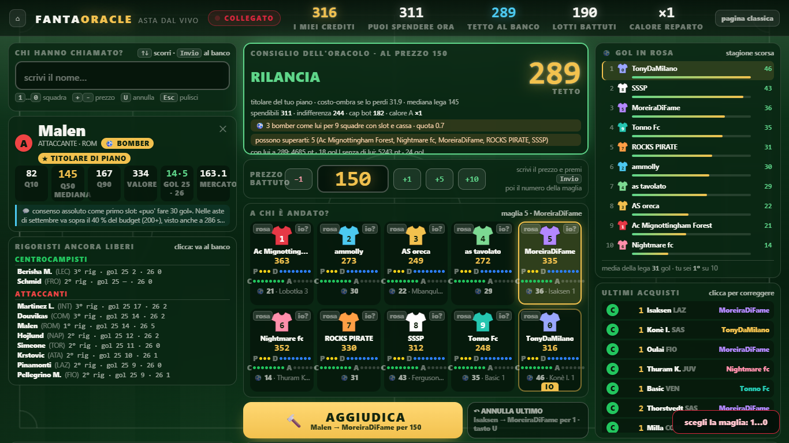
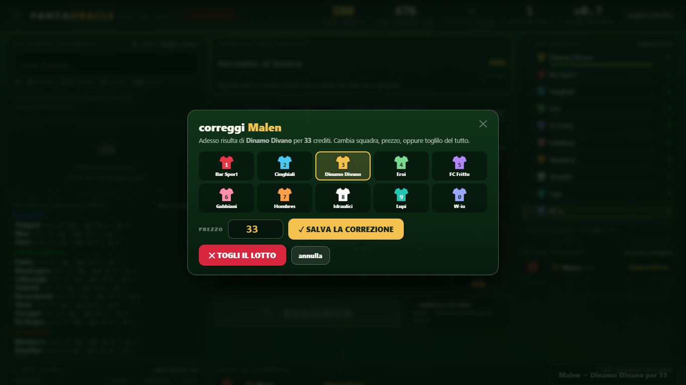
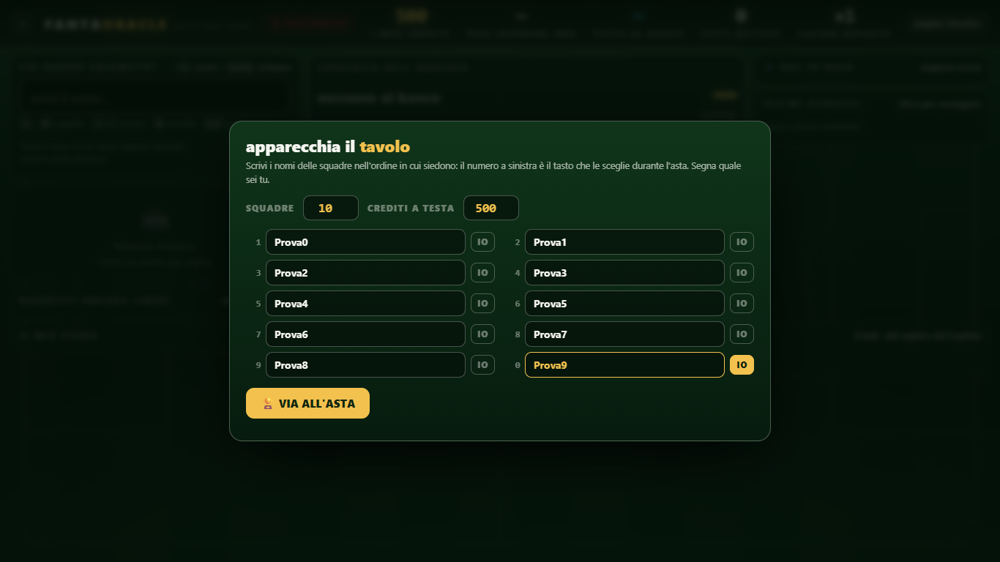
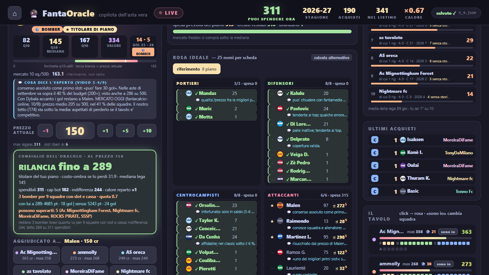

# 🔮 FantaOracle

**Un oracolo per l'asta del fantacalcio: dice fino a quanto puoi spingerti su ogni giocatore mentre il
banditore sta battendo — e si collega da solo all'app su cui si gioca l'asta.**

Non è un listone con dei numeri accanto: è un modello di prezzo, un modello di valore, un ottimizzatore di
rosa che ripianifica a ogni martelletto e un Copilota che tiene il conto di tutte e dieci le squadre.

### Quattro numeri che contano

| | fonte |
|---|---|
| Il tetto sul giocatore più conteso dell'asta vera passa da **116 a 289** crediti, contro i **275** che il tavolo ha davvero pagato | `reports/asta_20260913/FIX_SERVER.md` (116 col codice del 10/9), `VERIFICA.md` §3 e `replay_tetto.md` evento 190 (289) |
| Tetti che sforano il massimo legalmente spendibile, su 28 lotti rigiocati: **0** | `replay_tetto.md` §intestazione, riconfermato in `VERIFICA.md` §3 |
| **250 martelletti** rigiocati contro il server in due ordini di ruoli diversi: **zero errori**, tempo massimo 354 ms | `reports/asta_20260913/VERIFICA.md` §5 |
| Il pack della stagione porta **594 giocatori**, di cui **531** acquistabili con una previsione | `GUIDA_ASTA.md` §«Che dati sta usando» |

Prove sui cinque file del percorso d'asta, 13 settembre: **83 passate, 1 saltata**
(`reports/asta_20260913/VERIFICA2.md` §1). Suite intera del 10 settembre: 660 passate, 2 saltate, 5 xfail
dichiarati, 1 rossa nota e spiegata (`reports/STATO_LIVELLI_20260910.md`, ore 15:10). Lega di riferimento:
dieci amici, 500 crediti, rosa 3-8-8-6, modificatore di difesa, un gol di squadra ogni 66 fantapunti, e —
dettaglio che cambia tutto — il gol vale **+5** invece dei +3 della fonte dei voti.

## 🎙️ Asta dal vivo, in autosync con FantaAsta Live

La sera dell'asta il problema non è sapere quanto vale un giocatore: è registrare quaranta aggiudicazioni
all'ora mentre cerchi di pensare. Il ponte toglie di mezzo la registrazione.

`viz/ponte_fantaasta.js` gira **dentro** la scheda di FantaAsta Live. Ogni **1,5 secondi** legge lo stato
che l'app tiene nel browser (la chiave `FANTA-ASTA-2025-LIVE`: squadre e assegnazioni con `index`,
`teamId`, `playerId`, `cost`) e manda al Copilota locale ogni assegnazione nuova con un `POST
/copilot/hammer`. Tre cose lo rendono usabile sotto pressione:

- **Idempotenza.** Ogni assegnazione porta un identificativo costruito dai suoi stessi dati,
  `fa-<index>-<playerId>-<teamId>-<cost>`: se ricarichi la pagina, se il ponte riparte, se un giro si
  sovrappone al successivo, la stessa aggiudicazione non entra due volte. Gli identificativi dei giocatori
  sono quelli di fantacalcio.it, cioè gli stessi del pack: nessuna riconciliazione per nome.
- **Annullamenti.** Se un'assegnazione già inviata sparisce da FantaAsta (annullata o svincolata) **ed è
  l'ultima registrata**, il ponte chiama `/copilot/undo` da solo. Se non è l'ultima non inventa niente: va
  in ERRORE, blocca quel lotto e chiede di sistemarlo a mano; poi lo si riapre con
  `window.PONTE.sblocca(<indice>)`.
- **Mappa delle squadre.** FantaAsta ha id 0..9 e un nome, il Copilota ha i nomi del tuo setup:
  l'abbinamento è per nome esatto (senza accenti), poi per prefisso, poi per posizione, e si ricalcola da
  solo quando i nomi cambiano.

In basso a destra compare un **riquadro di stato** — assegnazioni inviate, ora dell'ultimo giro, OK o
ERRORE: è l'unica cosa da tenere d'occhio, e in console restano `window.PONTE.stato()`, `.ferma()`,
`.rimappa()`. Si accende in due modi: col **preferito** che `scripts/ponte_bookmarklet.py` genera in
`viz/ponte.html` (servita dal menu, con la prova di connessione che deve elencare i dieci nomi), oppure
con l'**iniezione via CDP**, `scripts/asta_chrome.py inietta [porta]`, che si collega a un Chrome già
aperto con la porta di debug e legge anche lo stato (`stato`, `picks`, `console`) quando il ponte va
diagnosticato in corsa.

**Cosa richiede.** Chrome deve poter parlare con un server in ascolto sulla tua macchina: alla prima
chiamata chiede il permesso di accedere alla rete locale e va concesso. I dettagli operativi, con i casi
che vanno storti, stanno in [`GUIDA_ASTA.md`](GUIDA_ASTA.md). Il ponte manda **solo le aggiudicazioni**,
non i rilanci, e vuole una sola scheda di FantaAsta aperta. Provato su un'asta a dieci squadre: **43
assegnazioni su 44 identiche** (giocatore, squadra, prezzo), ritardo medio **0,6 s**, nessun doppione dopo
un ricaricamento (`GUIDA_ASTA.md` §«Collegamento automatico»).

### Correggere un lotto vecchio

Il 10 settembre spostare il lotto numero 42 è costato **81 annullamenti e 82 martelletti**, perché l'unica
correzione possibile era annullare dalla coda (`reports/asta_20260913/FIX_Z.md` §Z5). Ora c'è `POST
/copilot/evento_modifica`: si indirizza una riga per posizione o per identificativo di richiesta, se ne
cambia squadra o prezzo, o la si toglie. La lista candidata viene validata **per intero** prima di
sostituire lo stato — se la correzione manderebbe una cassa sotto zero, riempirebbe un reparto oltre la
quota o lascerebbe una squadra senza i crediti per gli slot che le restano, il server rifiuta in blocco e
non tocca niente — e ripetere la stessa richiesta risponde `{"ok": true, "duplicato": true}` senza secondo
effetto. Dal terminale: `python scripts/asta_registra.py --modifica "42 > Nome : 12"`, `--rimuovi 42`,
`--elenco`.

### Cosa vedi al tavolo

`viz/asta.html` è pensata per essere letta a due metri, di sera, mentre qualcuno urla un rilancio: il
**tabellone** in testata con cinque numeri grandi (i miei crediti, **PUOI SPENDERE ORA** — i crediti meno
un credito per ogni altro slot da riempire —, il **tetto** sul giocatore al banco, i lotti battuti, il
calore del reparto); il **consiglio**, un numero grande con sotto la riga che lo spiega (spendibili, tetto
del bot, prezzo di indifferenza, calore, quanti bomber restano e per quante squadre); le **dieci maglie**,
che si scelgono coi tasti `1`…`9` e `0` — prezzo, Invio, numero della maglia, martelletto; **GOL IN
ROSA**, la classifica dei gol veri delle dieci rose (`/copilot/gol_rosa`), il campionato parallelo che in
una lega dove il gol vale 5 decide più di quanto sembri; e ancora scarsità per reparto, rigoristi liberi,
chi può superarti. Niente scorrimento orizzontale a 1366 e a 1920 px, nessun `NaN` a schermo, console
pulita: 58 prove automatiche, più 21 rifatte a mano da un verificatore indipendente con un solo
rilievo, sulla leggibilità delle etichette piccole (`reports/asta_20260913/VERIFICA2.md` §4 e D1). Le
due pagine si rimandano a vicenda: «pagina classica» da una parte, «pagina nuova» dall'altra, stessa porta.

### Screenshot

Stato reale dell'asta del 10 settembre, rigiocato fino al lotto 190, col giocatore più conteso al banco
a 150: tetto 289, spendibili 311, tre bomber rimasti per nove squadre.



Correggere un lotto già battuto — squadra, prezzo, o toglierlo — senza annullare quelli dopo:



Il tavolo appena apparecchiato, e la pagina classica sullo stesso stato (PUOI SPENDERE ORA in testata, gol
in ogni lista, GOL IN ROSA a destra):





**Se il ponte non parte**, l'asta si fa lo stesso: si cerca il giocatore, si scrive il prezzo, si preme la
maglia; oppure in blocco dal terminale con `python scripts/asta_registra.py "Nome > Squadra : 205"`. E se
muore il computer c'è il listino di carta (`scripts/f14_listino_offline.py`).

## 📐 La matematica dentro

### Prezzi

Il prezzo previsto non è un numero ma una forchetta: $q_{10}, q_{50}, q_{90}$ da un ensemble **TabPFN-2 +
CatBoost**, con quantili conformalizzati fuori campione. L'archivio contiene **216 aste reali**
(`reports/LIVELLO4.md`, fase 8A), ma il bersaglio in uso oggi ne usa **88**, e nessuna del 2025-26: è il
primo difetto dichiarato del livello 4 (`reports/STATO_LIVELLI_20260910.md` §L4). Lo studio che
allargherebbe il campione — smettere di filtrare le aste «uguali alla nostra», che sono 12, e mettere la
configurazione della lega **come colonne**: componenti, crediti, modificatore, periodo, fonte — è una
proposta di architettura, non ciò che gira (`reports/ARCHITETTURE_2.0.md`).

Alla mediana si fonde il mercato vivo, con peso 0,6:

$$q_{50}' = 0{,}6 \cdot p_{\text{mercato}} + 0{,}4 \cdot q_{50}, \qquad
q_{10}' = q_{10} + \Delta, \quad q_{90}' = q_{90} + \Delta$$

con $\Delta = q_{50}' - q_{50}$ (`src/fantabot/market_adjust.py:181-184`, identità verificata su 369
giocatori). Due cose vanno dette, e sono scritte nei report: il peso **0,6 non è mai stato misurato** e
con questo archivio non è misurabile, perché i listini delle stagioni con aste reali sono tutti posteriori
all'asta; e la traslazione non preserva l'ordine dei quantili — tre portieri escono con $q_{10} > q_{50}$
(`reports/STATO_LIVELLI_20260910.md` §«Correzioni al quadro del 9/9»). Il «prezzo di mercato» in scheda
non è quindi un secondo parere indipendente: è lo stesso mercato, aggregato diversamente.

### Valore, e il gol che vale cinque

Il valore è il punteggio atteso di stagione — fantamedia proiettata × presenze proiettate, da un CatBoost
sui punti (baseline «Marcel» in `src/fantabot/modeling/value.py`) — poi rettificato per indisponibilità,
probabilità di titolarità e rigori. C'è però un difetto che il modello non poteva vedere: il fantavoto
della fonte somma già **+3** per ogni gol, questa lega ne paga **+5**. Un bomber era sotto di due punti
per gol, un centrocampista da 6 in pagella non perdeva niente. `applica_bonus_gol` (in
`scripts/f10_copilot.py`) aggiunge

$$\Delta_{\text{gol}} = (5 - 3) \cdot \widehat{g}$$

a `value`, `value_modello`, `value_up` e a tutti i quantili di valore. **I prezzi non si toccano**: quelli
li fa il mercato.

$\widehat{g}$, i gol attesi, è un proxy dichiarato e non un modello di gol (`gol_attesi_di`): il tasso
della stagione scorsa portato sulle presenze previste, con tetto a +20 %; chi l'anno prima in Serie A non
c'era ma quest'anno gioca già usa il tasso in corso, scontato del 30 % perché tre giornate sono un
campione minuscolo; chi non ha né l'uno né l'altro riceve `null` — **non zero**. Effetto misurato: 425
giocatori rettificati, 0 scostamenti dalla formula, media per reparto **P +0,0 · D +3,3 · C +5,5 · A
+10,5** (`reports/asta_20260913/VERIFICA.md` §4).

### Calore di mercato, per reparto

Quanto il tavolo sta pagando sopra le mie stime. Su tutto il mercato:

$$h = \operatorname{clamp}\!\left(\frac{\sum \text{prezzi battuti} + 250}
{\sum q_{50} + 250},\ 0{,}5,\ 1{,}8\right)$$

(`src/fantabot/bots/bot_b.py:49-58`); il prior di 250 crediti serve a non far gonfiare tutti i tetti da un
singolo lotto strapagato.

Il problema è che l'asta si gioca a **blocchi di ruolo**: a inizio blocco attaccanti il calore «globale»
descrive il mercato dei centrocampisti. `calore_ruolo(R)` ripete lo stesso conto **dentro il ruolo**, con
prior 60 crediti verso 1,0 e limiti [0,5 · 2,0], e vale esattamente **1,0** quando in quel ruolo non è
stato battuto ancora niente — «non lo so ancora», invece di un numero preso da un altro mercato. A fine
asta simulata: calore globale 0,98, calore per ruolo **P 0,883 · D 0,696 · C 0,579 · A 1,491**
(`reports/asta_20260913/VERIFICA.md` §5).

### Prezzo di indifferenza

La domanda vera dell'asta non è «quanto vale»: è «fino a che prezzo mi conviene, sapendo che comprarlo mi
toglie i crediti per tutti gli altri».

$$p_{\text{ind}} = \max\{\,p : \text{obiettivo}(\text{piano con lui a } p)
\ \ge\ \text{obiettivo}(\text{miglior piano senza di lui})\,\}$$

Si trova per bisezione: il piano di riferimento è il MILP risolto con quel giocatore **bandito**, poi si
cerca il prezzo di pareggio richiamando `piano_al_prezzo` (`src/fantabot/piani.py:234`), che impone il
giocatore in rosa a un prezzo dato e ricompleta tutto il resto.

Costa: un MILP sono ~0,25 s e la bisezione ne vuole dieci. Il calcolo parte quindi in un thread demone
**fuori dal lock**, con al massimo 10 MILP da 2 s e un semaforo a due solutori; la prima risposta dice
`in_calcolo` e usa il tetto del bot, al giro dopo il numero c'è (sui 28 lotti del replay il più lento in
**1,43 s**). La cache ha la versione dello stato nella chiave e si pota per versione, mai in blocco:
svuotarla tutta faceva sfarfallare il numero grande fra 289 e 272 ogni due secondi — uno dei difetti
trovati dalla verifica e corretti (`VERIFICA.md` §V1, `FIX_Z.md` §Z1).

### Premio di scarsità, e il tetto

Il tetto del giocatore al banco parte dal prezzo di indifferenza e sale verso il massimo spendibile in
proporzione a quanto è raro chi fa quello che fa lui:

$$s = \operatorname{clamp}\!\left(\frac{n - b}{n},\ 0,\ 1\right), \qquad
n = \text{contendenti} + 1$$

$$\text{tetto} = \min\Big(\text{spendibile},\ \max\big(\text{cap}_{\text{bot}},\
p_{\text{ind}} + s \cdot (\text{spendibile} - p_{\text{ind}})\big)\Big), \qquad \text{spendibile} =
\text{crediti} - (\text{slot} - 1)$$

dove $b$ sono i bomber rimasti **almeno bravi quanto lui** (non la categoria: i suoi sostituti), e i
contendenti sono gli avversari che hanno ancora uno slot in quel ruolo *e* la cassa per arrivarci.
`tetto_scarsita` è una funzione pura, provata sugli otto casi del prototipo
(`tests/test_copilot_tetto.py`).

Due guardie, dichiarate come scostamenti dal contratto originale. Il premio va **solo** a chi ha già fatto
gol da bomber in Serie A (soglia 10 per gli attaccanti, 6 per i centrocampisti, sulla stagione piena
precedente): chi è bomber per il solo passo di tre giornate resta contato nel pool ma torna al tetto del
bot — senza questa regola un giocatore con quattro gol in tre giornate usciva con un tetto di **251** su
un lotto chiuso a **80** (`FIX_Z.md` §Z2). E il **ramo dell'obbligo** viene prima di tutto: se i
comprabili del reparto bastano appena per i tuoi slot, il tetto è il massimo legale. Il tetto non supera
mai il massimo spendibile e non scende mai sotto quello che il bot produce da solo: è un **pavimento
aggiunto**, non una politica sostituita.

### Il MILP della rosa

Variabili binarie: $x_i$ compro, $s_i \le x_i$ titolare, $m_k$ modulo (uno solo fra sette). Obiettivo:

$$\max \sum_i v_i \big(w_b\, x_i + (1 - w_b)\, s_i\big), \qquad w_b = 0{,}30,
\qquad v_i = \text{value}_i + \lambda\,(\text{value\_up}_i - \text{value}_i)$$

La panchina vale una frazione del titolare perché la stagione premia gli undici migliori per giornata, non
i venticinque. Vincoli: quote piene per ruolo, titolari uguali agli slot del modulo scelto, budget, spesa
minima (`min_spend`, che tiene comunque un credito per ogni slot da riempire) e `forced_spend` per reparto
— la quota di spesa in attacco, qui 35-50 %. I posseduti entrano come `fixed` a prezzo zero; `required`,
`banned` e `required_starters` servono al prezzo di indifferenza e alle esclusioni manuali
(`src/fantabot/optimizer.py:25-128`). Un dettaglio che sembra un cavillo e non lo è: `value` è la somma
grezza dei venticinque, `objective` è il valore della funzione **davvero massimizzata** — ordinare due
piani col primo numero mentre il solutore ottimizza il secondo significa confrontarli con un metro che non
è quello usato per costruirli.

### La stagione, e perché non basta massimizzare i punti

L'obiettivo non è la rosa con più punti attesi: è **arrivare primi**. Il generatore rigioca stagioni
intere — formazione scelta senza senno di poi sulla fantamedia mobile fino alla giornata prima, fino a tre
sostituzioni, punteggio coi fantavoti reali — e converte i punti in gol con la regola della lega: **66**
fantapunti sono un gol, poi **uno ogni 6** (`src/fantabot/season/lineup.py:100`). Il modificatore di
difesa somma la media dei voti puri di portiere e tre migliori difensori, con le fasce della lega (6,0 →
+1 … 7,0 → +5, `config/league.yaml`).

Le fasce sono il motivo per cui la media non basta: 66 punti fanno un gol e 71 ne fanno due, quindi una
rosa più forte in media può vincere meno spesso di una più esplosiva. Da qui la scelta dell'obiettivo con
Monte Carlo (`scripts/f12_choose_objective.py`): si provano combinazioni di $\lambda$ e quota d'attacco
contro archetipi a prezzo di mercato e si tiene quella che massimizza P(1° posto), non i punti. Per la
stagione in corso: $\lambda = 0{,}5$, quota attacco 35-50 %, modulo libero, **P(1°) 56 %** in scelta su
100 simulazioni e **57 % ± 5** in verifica (`GUIDA_ASTA.md`) — numero interno del modello contro i nostri
archetipi, non una promessa sul tavolo vero.

### Disciplina temporale: la fuga che è stata trovata

Un simulatore che si giudica da solo dice sempre di funzionare. Il controllo più importante del progetto è
sul **tempo**: non basta che una feature esista prima dell'asta, bisogna sapere *come la si sa*.
Misurando, due feature del modello delle presenze contenevano l'esito: **`fvm`**, che nei listoni
archiviati è un valore di **fine** stagione (rho di rango 0,900 con la quotazione finale contro 0,708 con
quella iniziale, sul 2024-25), e **`quot_fs_sett`**, uno snapshot settimanale rilevato **dopo** la prima
giornata. Toglierle costa, e il costo è il punto: l'errore sulle presenze passa da 5,5688 a 8,1259
(**+2,5571** MAE, errore standard 0,0150, cinque semi, differenza appaiata — `RIPRESA.md` §3ter). Un
modello che le usa sembra più bravo di quanto sarà all'asta.

Allora `src/fantabot/contratto_players.py` scrive, **accanto** al parquet e senza toccarlo, un contratto
che classifica tutte e **66 le colonne** con la prova — disponibile alla decisione, ricostruito a
posteriori, non verificabile, posteriore all'origine — dove $\text{origine} = \min(\text{data d'asta
dichiarata},\ \text{prima partita della giornata } k{+}1)$. La conseguenza è dichiarata: le due feature
sono posteriori nei backtest a $k = 0$ e diventano legittimamente disponibili per la stagione in corso a
$k = 3$. Poi la prova decisiva, col criterio scritto prima: bersaglio onesto MAE **7,929** e rho **0,617**
contro la regola banale 10,069 e 0,444 — superata, su una sola stagione e senza barre d'errore
(`reports/STATO_LIVELLI_20260910.md`, ore 12:20).

### Cosa **non** è stato promosso

L'onestà è parte di quello che rende utilizzabile il resto.

| candidato | esito | numeri |
|---|---|---|
| **Cubo TABELLINO** (generatore di stagioni fisicamente coerente, livello 2) | **non promosso** | anche col bersaglio pulito, sulle marginali fa peggio del bersaglio da solo: MAE +0,0346, es 0,0021, \|t\| 16,8 |
| **Livello 3** (rosa che massimizza P(1°), tetti da P(1°) al martelletto) | **inconcludente**, non attivato | banco appaiato su 264 aste: L3 − B = −0,0227, IC95 [−0,050, +0,004] |
| **Calibrazione per segmento dei prezzi** (conformal per fascia × ruolo) | **non adottata** | la sonda passava tutti e cinque i criteri; col riadattamento corretto copertura 0,886 (fuori banda), pinball +1,39 %, ampiezza +37,7 %; e solo 2 celle su 24 hanno n ≥ 30, quindi «per segmento» è in pratica globale |

Un esito inconcludente resta inconcludente: non diventa equivalenza e non diventa una promozione. Il
risultato ritrattato è lasciato accanto a chi lo ritratta (`reports/STATO_LIVELLI_20260910.md`,
aggiornamento delle 15:10).

## 🔨 Cosa ha insegnato l'asta vera del 10 settembre

Il Copilota c'era, i numeri erano giusti, e sui lotti grossi diceva di lasciar perdere mentre il tavolo
pagava. L'audit ha trovato cinque difetti, tutti dello stesso tipo: il consiglio non sapeva in che partita
si trovava.

1. **Tetto cieco.** Il tetto era `(q90 + 0,5 · prezzo-ombra) × calore`, e basta: non sapeva quanti crediti
   avevi in cassa, quanti slot ti restavano, quanti bomber c'erano ancora, quante squadre potevano
   pagarli.
2. **Calore rovesciato.** Un solo termometro per tutto il mercato: all'inizio del blocco attaccanti diceva
   «mercato freddo» (0,62) e avrebbe abbassato del 38 % i tetti proprio dei lotti su cui si decide l'asta.
3. **Obbligo morto.** La scarsità contava le teste rimaste nel ruolo, non chi fa gol davvero: con undici
   «bomber» per sei compratori la quota è zero sempre, e il premio non scattava mai — la sera in cui il
   tavolo si scannava per due nomi.
4. **Tetto duro a 250.** La quota di spesa in attacco si misurava sul budget **totale** ($0{,}50 \times
   500 - \text{già speso}$): con sei slot d'attacco liberi il piano **non poteva** proporre 275, per
   costruzione. Ora guarda il residuo, e il piano di riferimento arriva a spendere **315,1** in attacco
   (`FIX_SERVER.md` §D4).
5. **Gol invisibili.** I gol non arrivavano ai consigli, e nella fonte stanno su due colonne (gol e
   rigori): contarne una sola toglieva 3 gol al bomber più conteso e 11 alla rosa intera.

Il replay lotto per lotto, sui 28 attaccanti battuti a 40 crediti o più
(`reports/asta_20260913/replay_tetto.md`):

| lotto | pagato dal tavolo | tetto del bot prima (calore globale) | tetto dopo |
|---|---:|---:|---:|
| il più conteso (ev 190) | 275 | 122 | **289** |
| secondo bomber (ev 193) | 255 | 127 | **300** |
| terzo bomber (ev 200) | 200 | 102 | **219** |
| bomber di tre giornate (ev 199) | 80 | 23 | **42** |

Il tetto arriva al prezzo del tavolo in **7 casi su 28** (prima, sui lotti grossi, praticamente mai); sui
quattro lotti della diagnosi **3 su 4**; tetti sopra il massimo spendibile **0 su 28**, che era il vincolo
duro.

**Cosa resta aperto**, dichiarato: un lotto resta fuori di quattro crediti perché quel giocatore non ha
mai giocato in Serie A e nel progetto non c'è una misura di «bomber atteso» dai campionati esteri; la
quota di scarsità è zero su quasi tutti i lotti, quindi è il pezzo meno esercitato dai dati veri; e il
bonus gol vive **solo** nel Copilota, perché la catena a monte continua a produrre `value` con +3 per gol
(`FIX_SERVER.md` §4). E la frase da ripetersi prima di sedersi: **il tetto è un limite, non un'offerta.**

## 🗓️ Prossimo aggiornamento: l'asta di riparazione

A gennaio la lega riapre: **+100 crediti** a testa, svincoli e scambi. Nel modello non c'è ancora niente
di tutto questo — `config/league.yaml` lo registra come contesto (`repair_context`) e dichiara che non è
modellato (`repair_auction: false`). Questo è il piano, non una promessa, e non ha una data.

1. **La contabilità nuova.** Crediti residui + 100, rosa già piena, e le due mosse che a settembre non
   esistono: svincolare (liberi uno slot e non recuperi il prezzo) e scambiare.
2. **Il valore a stagione in corso.** A gennaio i voti veri ci sono: il valore residuo non è più una
   proiezione d'agosto ma una fantamedia osservata su venti giornate, da pesare contro le diciotto che
   restano — l'aggiornamento settimanale che già gira, portato a dire «quanto vale da qui alla fine».
3. **Il prezzo di indifferenza sui soli slot da riempire.** La matematica è la stessa; cambia il contesto
   del MILP — quote quasi piene, budget piccolo, e piano di riferimento la rosa che hai, non una rosa
   vuota. Con pochi slot liberi diventa il numero più informativo della sessione.
4. **La formazione di giornata**, che esiste già: `scripts/f17_formazione.py` legge la rosa vera dal
   registro dell'asta, le probabili e gli indisponibili, e usa il motore di stagione (moduli, tre cambi,
   modificatore). La qualità del consiglio **non è ancora stata valutata**
   (`reports/STATO_LIVELLI_20260910.md`, ore 12:20).

Il pezzo mancante più grosso non è il codice: una riparazione a metà stagione non si può validare col
banco estivo. Serve un protocollo suo.

## 🚀 Provalo

La demo funziona **senza i dati originali**, esclusi dal repository perché scaricati da fonti terze (vedi
[`DATA.md`](DATA.md)):

```bash
pip install -r requirements.txt
python scripts/fantaoracle_app.py
```

Si apre il menu su `http://localhost:8899`. Da lì: **Replay**, un'asta come un teatro coi pensieri di ogni
bot a ogni rilancio — perché ha rilanciato, quanto era disposto a pagare, cosa ha ricalcolato dopo aver
perso; **Sedia**, dove ti siedi tu al tavolo contro i bot; **Asta** (`viz/asta.html`), con la precedente
sempre disponibile come «pagina classica»; **Ponte** (`viz/ponte.html`).

**Su un altro computer, con i dati veri** — [`INSTALLA.md`](INSTALLA.md):

```bash
python scripts/prepara_bundle_asta.py          # sul computer che ha i dati
git clone https://github.com/ArtyomITA/fantaoracle.git
python installa.py --bundle <bundle.zip>       # sul computer nuovo
```

`installa.py` crea l'ambiente virtuale, installa il necessario, scompatta il bundle (dodici file, meno di
un megabyte), verifica e fa una prova di fumo: avvia il Copilota su una porta di prova, chiede
`/copilot/state`, lo spegne. Si può rilanciare: non rifà quello che c'è già. Senza rete e senza GitHub,
`python scripts/prepara_chiavetta.py <destinazione>` copia il progetto intero su una chiavetta (~160 MB,
compresi i pacchetti pip già scaricati per Python 3.11-3.13 in `wheelhouse/`, così sul portatile non serve
nemmeno la rete) con un avviatore (`AVVIA_SU_PORTATILE.bat`) e un leggimi; serve solo Python 3.11 o più
recente.

## 📊 Livelli e metodo

| livello | che cosa aggiunge | stato |
|---|---|---|
| **0-1** | dati, modelli di prezzo e valore, motore d'asta, bot, torneo; contratto temporale sulle 66 colonne del listone | in uso; verifica **parziale** |
| **2** | generatore di stagioni fisicamente coerente (cubo TABELLINO) | **non promosso** (MAE +0,0346, \|t\| 16,8) |
| **3** | rosa che massimizza P(1° posto), tetti da P(1°) al martelletto | **non attivato**: 264 aste, Δ P(1°) −0,0227, IC95 [−0,050, +0,004] |
| **4** | prezzi dalle aste reali | in uso il modello attuale (mediana 60 % mercato + 40 % modello); calibrazione per segmento **non adottata** |
| **5** | stagione in corso: aggiornamento settimanale, formazione di giornata, scambi, svincoli, riparazione | aggiornamento e formazione ci sono; il resto è il capitolo qui sopra |

Tre regole di metodo, applicate anche quando fanno perdere tempo: prima la causa riprodotta, poi la
correzione, poi la misura; i criteri si scrivono **prima** dell'esperimento; un esito inconcludente resta
inconcludente. Quando una verifica ribalta una conclusione, la correzione si scrive **accanto**
all'originale invece di riscrivere la storia ([`reports/PROTOCOLLO_v2.md`](reports/PROTOCOLLO_v2.md)).
Ogni esecuzione ha la sua cartella, con un manifesto che porta configurazione, semi, scenari e impronte
degli ingressi — dati **e moduli** — e ogni artefatto si verifica rileggendolo. Il lavoro sul Copilota del
13 settembre è passato per due verificatori indipendenti dai due autori: `reports/asta_20260913/`.

## 🗂️ Struttura del repository

```
src/fantabot/
  engine/      motore d'asta a eventi, con registro JSONL
  bots/        A (baseline), B (il nostro), C (otto profili umani)
  season/      formazioni, sostituzioni, punteggio di lega, campionato H2H
  tabellino/   generatore (partita, partecipazione, eventi, voto), contratto delle viste
               temporali, origine, presenze, calibrazione SPSA, inferenza, esecuzione
  livello3/    valutatore, ricerca su candidate, MILP esatto, indifferenza
  optimizer.py MILP della rosa;  piani.py  piani e «se lo compro a X»
scripts/       pipeline dei dati, banchi, esperimenti, Copilota (f10), ponte
tests/         53 file di prova
reports/       ogni conclusione con la sua prova
viz/           replay, Sedia, asta, Copilota classico, ponte
```

## 📄 Licenza e dati

Codice sotto licenza MIT. I dati grezzi non sono ridistribuiti: appartengono alle fonti e si rigenerano in
locale con gli script della pipeline, per uso personale. I pesi di TabPFN non sono nostri e non stanno nel
repository: la libreria li scarica da sé. Provenienza e dettagli in [`DATA.md`](DATA.md).

Progetto personale, costruito per una lega di dieci amici.
